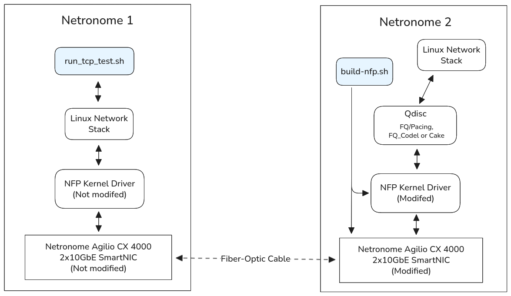
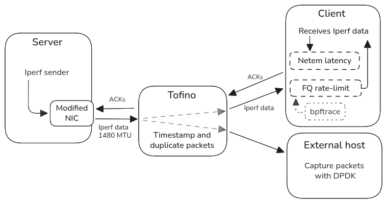

# TSO-and-Pacing-on-modified-Netronome-Firmware
A modification of Netronome Agilio CX 4000 firmware (CoreNIC) to support TSO Pacing. Developed for a master's thesis at UiO.

The repository contains:
 1. Modifications to the [Agilio CX Firmware](https://github.com/Netronome/nic-firmware), found in [`notify.c`](modified-nfd-firmware/notify.c)
 2. Modifications to the [Agilio CX Drivers](https://github.com/Netronome/nfp-drv-kmods), found in [`nfp_net_common.c`](modified-nfd-driver/nfp_net_common.c)
 3. Scripts for building the modified drivers and firmware
 4. Scripts for development and testing at the UiO IFI setup
 5. Scripts for running experiments and analyzing the results for the Darmstadt setup

Relevant repositories:
- [Agilio CX Firmware](https://github.com/Netronome/nic-firmware)
  - [Firmware for kernel 5.4](https://github.com/Netronome/nic-firmware/releases/tag/nic-2.1.16.1)
- [Agilio CX Firmware for NFD_IN specifically](https://github.com/Netronome/nfd)
- [Agilio CX Drivers](https://github.com/Netronome/nfp-drv-kmods)
- [Atle's repo](https://github.com/atleikan/pace-tso)
- [Per Magne's repo](https://github.com/Permki/PacedLinux)
- [My overleaf document](https://www.overleaf.com/read/ppbcztrrzddp#2feaa4)

## Requirements

### Development environment
Requirements for development and testing at the UiO IFI setup:



#### Server 1 (Netronome 2)
To compile the modified NFP driver and CoreNIC firmware a machine with the following is required:
- A Netronome Agilio CX 4000 SmartNIC 2x10GbE
- Ubuntu 18.04, with Linux kernel 5.4
- NFP Kernel drivers (should come preinstalled with Ubuntu 18.04)
- Netronome’s NFP Linux Toolchain
  - Can be retrieved by asking Netronome, as outlined [here](https://github.com/Netronome/nic-firmware?tab=readme-ov-file#toolchain-and-reference-manuals).
- GNU awk
  - `apt-get install gawk`
- The original CoreNIC firmware for Ubuntu 18.04
  - [Install from here](https://github.com/Netronome/nic-firmware/releases/tag/nic-2.1.16.1)
- The out-of-tree NFP drivers for Ubuntu 18.04
  - Download drivers: `git clone https://github.com/Netronome/nfp-drv-kmods.git`
  - Go back to correct version: `git checkout c44a501006f85050c4a1f0fbfd1031d56743ce7b`
- (For testing)
  - `iperf3`, `ethtool`

#### Server 2 (Netronome 1)
To run the tests, you also need a machine with another Agilio CX SmartNIC, directly attached to the one we are modifying:
- A Netronome Agilio CX 4000 SmartNIC 2x10GbE
- Ubuntu 18.04, with Linux kernel 5.4
- `netsniff-ng`, `iperf3`, `mergecap`, `cpufrequtils`, `ethtool`
- If you want to record queue lengths, see how to install bpftrace [here](#install-newer-bpftrace).

#### PC
You also need a personal machine for generating plots based on the packet captures from tests:
- Ssh access to Server 2
- `tshark`
- `python3` (pandas, numpy, matplotlib)

### Experiment environment
Requirements for running experiments at the Darmstadt setup with hardware timestamping:



#### Server 1 (Server)
Same as Server 1 from development environment.
- A Netronome Agilio CX 4000 SmartNIC 2x10GbE
- Ubuntu 18.04, with Linux kernel 5.4
- If you want to test with Cake, it should come preinstalled with kernel 5.4, however it might not be recognized by `tc`. If so, follow [this guide](#install-tc-which-recognizes-cake). 
- Rest is same as Server 1

#### Server 2 (Client)
More lightweight than Server 2 from development environment. Can be used for packet capture as well.
- A Netronome Agilio CX 4000 SmartNIC 2x10GbE
- Ubuntu 18.04, with Linux kernel 5.4
- `dumpcap`, `iperf3`, `cpufrequtils`, `ethtool`
- If you want to record queue lengths, see how to install bpftrace [here](#install-newer-bpftrace).

#### External Host
Administered/configured by our friends at Darmstadt.

#### Tofino
Administered/configured by our friends at Darmstadt.


## Modifying the NFP driver and CoreNIC firmware
The NFP drivers can be modified by changing the files in the NFP driver directory you installed, then compiling it. The [`nfp_net_common.c`](modified-nfd-driver/nfp_net_common.c) file contains our modifications to the driver, and can be copied to the out-of-tree NFD driver as follows:
```bash
cp ./modified-nfd-driver/nfp_net_common.c $HOME/master/modified-nfp-oot-driver-2019/src/
```

The CoreNIC firmware can similarly be modified by changing the files in the CoreNIC directory you installed, then compiling it. The [`notify.c`](modified-nfd-firmware/notify.c) file contains our modifications to the firmware, and can be copied into the CoreNIC firmware as follows:
```bash
cp ./modified-nfd-firmware/notify.c $HOME/master/modified-nfp-firmware/deps/ng-nfd.git/me/blocks/vnic/pci_in/
```

## Compiling and loading modified driver and firmware
To compile and load modified drivers and firmware, the [`build-nfp.sh`](scripts/build-nfp.sh) script can be used. 

First, modify its variables to reflect your environment. 

If wanted, the script can switch between modified and original drivers/firmware. To do this, you should have copies of the unmodified driver and firmware, and provide the path to these in the script. 

Running the build script:
```bash
sudo ./build-nfp.sh
```

The build script can be run with the following options
- `--help`
- `--skip-fw/--skip-driver/--skip-check`
  - Skips build & install for this part
- ` --skip-build `
  - skips building, just loads
- `--clean`
  - Runs make clean
- `--org/--org-fw/--org-driver`
  - Build the original firmware/driver
  - By default this skips building, to prevent rebuilding the same drivers/fimware here. When running for the first time, you need to explicitly build here (by modifying the script or running the commands yourself).

### Configuring the Netronome interface
Set the IP address (as the IP address might disappear after loading updated drivers. Alternatively, you can add a netplan file to set `enp2s0np0` to a static ip). 
```bash
# (example ip, use what is defined for the setup)
sudo ip addr add 192.168.50.1/24 dev enp2s0np0

# Confirm with:
ip -br addr show dev enp2s0np0
```

Enable/disale TSO:
```bash
sudo ethtool -K enp2s0np0 tso on gso on
sudo ethtool -K enp2s0np0 tso off gso off

# Confirm with:
sudo ethtool -k enp2s0np0
```

Setting the qdisc:
```bash
# fq
sudo tc qdisc replace dev enp2s0np0 root fq
# fq_codel
sudo tc qdisc replace dev enp2s0np0 root fq_codel
# Cake (with 1 Gbps cap)
sudo tc qdisc replace dev enp2s0np0 root cake bandwidth 1gbit besteffort flows no-split-gso

# Confirm with:
sudo tc qdisc show dev enp2s0np0
```

## Testing modifications

### Debugging
View memory of NIC:
```bash
sudo nfp-rtsym _wire_debug
```

Log/print statements from NFP driver:
```bash
dmesg | grep nfp
```

### Running test in development environment
To run a test, run the [`run-tcp-test.sh`](scripts/run-tcp-test.sh) script on Server 2:
```bash
sudo ./run-tcp-test.sh
```
(You might want to change some of the values, such as the ip addresses and folder names)

This generates a packet capture, which can be extracted by running the [`extract-pcap.sh`](scripts/extract-pcap.sh) script on your own machine (PC):
```bash
sudo ./extract-pcap.sh
```

### Running tests in Darmstadt environment
We have 4 scenarios/setups for testing, where we can test all at once with `run-all-experiment-runs.sh`:
- Direct link with FQ
- Datacenter with FQ
- Internet with FQ
- Datacenter with FQ_Codel

We also compare 3 different solutions:
- No TSO
- TSO
- TSO Pacing (our custom solution)

Before running tests, you can remove old run data:
```bash
cd ./scripts/experiment
sudo rm -r ./runs/
```

Run a single experiment (to check if everything works as expected):
```bash
sudo ./run-experiment-external-capture.sh --run-num 0 --direct-link --fq --no-tso
```

If everything looks good, you can move on.

#### Running all tests
To run all tests, we use the script `run-all-experiment-runs.sh`. Before running it, we have to load the unmodified or modified Agilio CX driver and firmware:
```bash
# Start with standard solution (assume org driver/firmware previously built)
sudo build-nfp.sh --org
sudo ./oslo_v1.sh up

# Run all tests for no-tso
sudo run-all-experiment-runs.sh --no-tso

# Run all tests for tso
sudo run-all-experiment-runs.sh --tso


# Load custom solution (again assume modified driver/firmware previously built)
sudo build-nfp.sh --skip-build

# Run all tests for tso pacing
sudo run-all-experiment-runs.sh --tso-pacing
```

Now all runs should be placed in `./scripts/experiment/runs/`.

To analyze from own computer:
```bash
./extract-pcap-experiment.sh
```

#### Only metrics and qlens
To only get the metrics and queue lengths (no packet capture) you can use `run-experiment-no-capture.sh`.
You can also modify `run-all-experiment-runs.sh` to use this.

#### Capture on client
To capture packets on the client (e.g. if external capture is not available), you can use `run-experiment-client-capture.sh`.
You will however have to analyze the pcap manually then, as the current `./extract-pcap-experiment.sh` assumes that `runs/` has timestamp csv files. 

To analyze a pcap file with `./extract-pcap-experiment.sh`, you can use something like this (by replacing the current lines using `parse-raw-timestamps.py`):
```bash
PCAP_IN="$(find "$RUN_PATH" -maxdepth 1 -name 'capture_*.pcapng' | head -n1)"
RAW_CSV="$TMP_DIR/tshark_raw.csv"
PARSED_CSV="$TMP_DIR/packets_parsed.csv"

echo "    $run_type: Extracting fields with thark..."
# Convert pcap to csv using tshark to extract following for timestamp analysis
tshark -n -r "$PCAP_IN" \
  -T fields -E header=y -E separator=, -E quote=d \
  -o tcp.desegment_tcp_streams:FALSE \
  -o ip.defragment:FALSE -o ipv6.defragment:FALSE \
  -o tcp.check_checksum:FALSE \
  -e frame.time_epoch -e frame.number \
  -e tcp.stream -e tcp.seq -e tcp.len \
  -e tcp.analysis.retransmission -e tcp.analysis.fast_retransmission \
  -e tcp.analysis.out_of_order -e tcp.analysis.lost_segment \
  -e data.data \
  > "$RAW_CSV"

echo "    $run_type: Parsing p4sta timestamps..."
# Run parse-p4sta-timestamps.py to extract timestamps from tcp payload
# payload -> extract first 48 bit timestamp by finding signature 0x0f in tcp options, then extracting 48 bit
python3 parse-p4sta-timestamps.py "$RAW_CSV" "$PARSED_CSV" "$RUN_NAME" "$run_num"
# Resulting csv contains: run_name,run_num,stream_id,tcp_len,p4_timestamp_ns

# Ensure packets are sorted (column 5 has timestamp)
{ head -n1 "$PARSED_CSV"; tail -n +2 "$PARSED_CSV" | LC_ALL=C sort -t, -k5,5n; } > "$PARSED_CSV.sorted"
mv "$PARSED_CSV.sorted" "$PARSED_CSV"
```


## Help, nothing works! 
So, you want to modify and compile custom drivers+firmware for the Agilio CX... and things are not working? Here are some problems I encountered and how I solved them:

#### Hardware not recognized
Sometimes (seemingly at random) the NFP driver load fails. This can be seen by... the fact that the interface does not work, e.g. you can't ping the other netronome card.
```bash
dmesg | grep nfp | tail -n 300
[51949.364539] nfp 0000:02:00.0 enp2s0np0: enp2s0np0 down
[51949.540390] nfp 0000:02:00.0 enp2s0np1: enp2s0np1 down
[51953.015350] nfp 0000:02:00.0: Firmware safely unloaded
...
[51953.099385] nfp 0000:02:00.0: Model: 0x40010010, SN: 00:15:4d:13:5c:8c, Ifc: 0x10ff
[51953.104454] nfp 0000:02:00.0: nfp_hwinfo: Unknown HWInfo version: 0x60000000
...
[53668.201353] nfp 0000:02:00.0: nfp_hwinfo: Unknown HWInfo version: 0x60000000
[53668.306517] nfp 0000:02:00.0: nfp_hwinfo: NFP access error
[53668.306526] nfp 0000:02:00.0: nfp: NFP board initialization timeout
[53668.306854] nfp: probe of 0000:02:00.0 failed with error -22
```
HFInfo is something the ARM firmware on netronome card builds after the chip resets ([source](https://coral.googlesource.com/linux-imx/%2B/refs/tags/11-2/drivers/net/ethernet/netronome/nfp/nfpcore/nfp_hwinfo.c)). If the version field is never set it implies something goes wrong when loading the custom firmware on the card. 

The solution? Reboot the machine (and possibly rebuild and load the firmware). Do this as many times it takes. I have found no other way to fix the issue, where resetting (or unbind/binding) the card does not work. 

#### Card stops transmission
A reason for the card freezing is if the `halt()` command runs in Notify, or if there is a deadlock (i.e. the threads are waiting for signals which are never raised.)

Try to place debug statements to find out if these are your culprit.

#### Strange results / random packet loss
If you get strange and inconsistent results, always remember to check if it is the testbed and not the solution. E.g. you could forget to reset the receiver after an experiment. 

#### General tips
In general when working on these cards it is very important to work iteratively. Make small modifications and check if it behaves as expected. Use debug to check if values make sense.

Also, remember to read the actual Netronome documentation (ask me if you don't have access to this), and read through the original firmware to understand how Micro-C and the Agilio CX architecture works. For `notify.c`, one of the first things I did was to read though the whole file and write comments to understand how it worked. `notify.c` with my comments is [here](modified-nfd-firmware/misc/notify-with-comments.c)


## Misc

### Install TC which recognizes Cake
What is looks like if tc does not recognize:
```bash
sudo tc qdisc replace dev enp2s0np0 root cake bandwidth 1gbit besteffort flows
Unknown qdisc "cake", hence option "bandwidth" is unparsable
```

Install:
```bash
sudo apt install -y   build-essential pkg-config bison flex   libmnl-dev libelf-dev libcap-dev zlib1g-dev
git clone https://git.kernel.org/pub/scm/network/iproute2/iproute2.git
cd iproute2
git checkout v5.4.0
./configure
make
sudo install -m 0755 tc/tc /usr/local/sbin/tc
hash -r

sudo modprobe sch_cake
sudo tc qdisc replace dev enp2s0np0 root cake bandwidth 1gbit besteffort flows
```

### Install newer bpftrace
Kernel 5.4 has an old bpftrace version. To install and use newer version (this worked for me):
```bash
mkdir -p ~/opt/bpftrace
cd ~/opt/bpftrace
curl -fL -o ~/opt/bpftrace/bpftrace   https://github.com/bpftrace/bpftrace/releases/download/v0.25.0/bpftrace
chmod +x ~/opt/bpftrace/bpftrace
./bpftrace --appimage-extract

# then use installed bpftrace with specific script:
sudo ~/opt/bpftrace/squashfs-root/AppRun ~/master/TSO-and-Pacing/scripts/experiment/record_qlen_ifb.bt
```

### IFI Subject recommendations
Recommendations for other students working on the Netronome cards at IFI. Independent of what courses you take, you should preferably have experience with networking, low-level programming, and concurrent programming.

**IN5050 – Programming heterogeneous multi-core architectures**
Fun and educational course. A lot of practial programming (as opposed to many other IFI courses...). Good practice for writing reports, troubleshooting, and benchmarking. Also good for low-level programming/hardware architecture, which is essential for working on the Netronome Cards.
And no final exam! Only 3 reports during the semester.

**IN5170 – Models of Concurrency** 
This course is all right, decent lecturers and a decent workload. Exam was relatively easy (ask me for previous exams for practice if you want, they don't publish them for some reason).
Good for gaining intuitive understanding of concurrency, deadlocks, and synchronization mechanisms, and practical real-world implementations of these (Java, Golang <3, and Rust) (also brief mention of Erland :( and C#)).
Also, only 2 small obligs the whole semester, each took only one afternoon to complete! 

**IN5060 – Quantitative Performance Analysis**
Not that technical, but good practice for handling and analyzing data sets for research purposes, visualizing data/results, and presenting this for a crowd. 

**IN4230 – Computer Networks** 
Course I probably should have taken. Introduction to networks (in detail), and especially relevant in that you program network protocols in C. Very relevant for both driver and firmware modifications for the netronome cards.

**IN4120 – Search Technology** 
Good course+lecturer, fun exercises, however not *that* relevant to the thesis. Covers lot of different topics within search engines which can also be applied in other fields (compression, data structures, fun text handling, vectors/embedding of language/text, basic machine learning)

(Also, use [karakterweb](https://www.karakterweb.no/) to see difficulty and ratings of IFI subjects)

## Other questions
If you have any questions I am more than happy to help. Just send me an email at kevin.nikolai.mathisen@gmail.com
E.g. I can provide the master thesis test data or my Zotero library of relevant papers with PDFs.